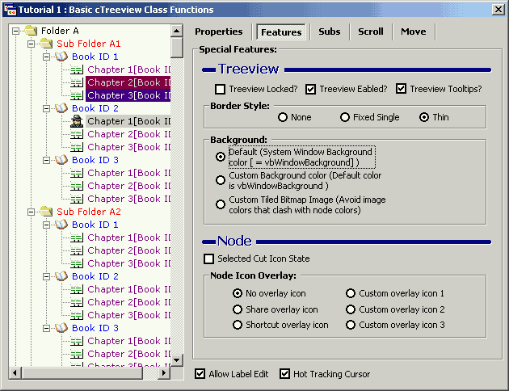

<div align="center">

## cTreeView Class wrapper v02\.03\.00 \(\*\*Updated 16/8 \- Animated Graphic TreeBack Demo \- UNIQUE\!\*\*\)


</div>

### Description

** Release 6 ** Added BackMode, BackColor, BackPicture, BackFileName, DisableMultiSelect, New Tutorial (Disable Multi-Node Select), updated Tutorial 1 (demonstrate new Back features) and added Animated TreeView Image Background (YES - A first! Pretty unique huh!). BackColor & BackPicture work independantly of the Nodes therefore Nodes maintain their original colors! No other VB code does this - enjoy!

** Release 5 - 26 New Features, 2 new Tutorials ** Now boasts 75 Properties & Methods (features), 7 tutorial/example applications and detailed Html help files and still growing!

New features include:- **Disabled Nodes Interface** with full keyboard and mouse support (Unique!), HitTestEx (with comprehensive feedback), IsNodeTextUnique, IsPathExpanded, NodeAbsolutePosition, NodeAbsoluteIndex, NodeCoord, NodeCountChildren (recursively for all sub-branches), NodeFindEx1 (containing), NodeFindEx2 (advanced pattern-matching), NodeFindObjectInTag (advanced pattern-matching), NodePosition, NodeUniqueText, SubNodesSorted, and EditLabelMaxLength.

The Disabled Nodes Interface allows individual nodes to be enabled/disabled (not selectable) and toggled with the ability to affect child nodes with a single command; disabled Fore/Back colours and Bold state are programmable (preserves the original Forecolor, Backcolor and bold status of each individual node) and fires a StateChange event when a node or a range of nodes are disabled/enabled. The treeview control by itself is a powerful control when used properly.

This wrapper is designed to deliver the most common and also complicated features that's expected from the control but are not included or are very difficult to implement. [See the animated ScreenShots for examples of the new features]

The included tutorials also demonstrate how to tie multiple ADO recordsets to a Treeview control with drag'n'drop automatic updates(move & copy nodes and branches), load-on-demand for instataneous display of large amounts of data; benchmarking; cursor management; TabStrip management; working with common dialogs through APIs; and much, much more...
 
### More Info
 


<span>             |<span>
---                |---
**Submitted On**   |2002-08-16 02:04:22
**By**             |[Slider](https://github.com/Planet-Source-Code/PSCIndex/blob/master/ByAuthor/slider.md)
**Level**          |Intermediate
**User Rating**    |4.9 (483 globes from 98 users)
**Compatibility**  |VB 6\.0
**Category**       |[Custom Controls/ Forms/  Menus](https://github.com/Planet-Source-Code/PSCIndex/blob/master/ByCategory/custom-controls-forms-menus__1-4.md)
**World**          |[Visual Basic](https://github.com/Planet-Source-Code/PSCIndex/blob/master/ByWorld/visual-basic.md)
**Archive File**   |[cTreeView\_1193088172002\.zip](https://github.com/Planet-Source-Code/slider-ctreeview-class-wrapper-v02-03-00-updated-16-8-animated-graphic-treeback-demo-uniqu__1-37553/archive/master.zip)


### Source Code

```
There is an update to this project that can be found at from <a href="
http://www.planetsourcecode.com/vb/scripts/ShowCode.asp?txtCodeId=39242&lngWId=1"> PSC! </a> Read decription for details on the 3 bugs fixed.
```

